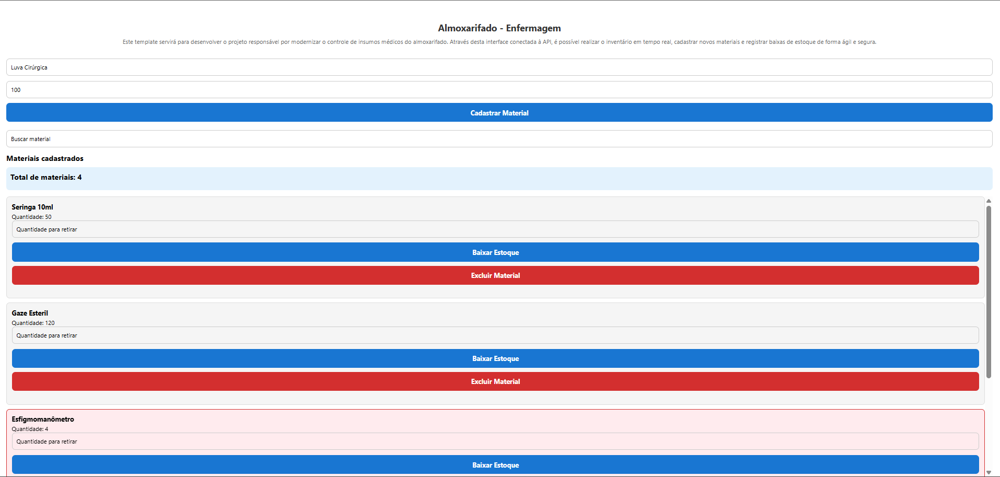
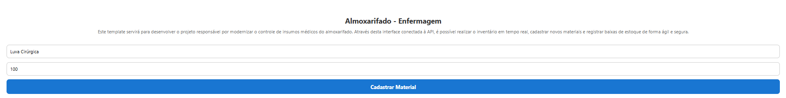
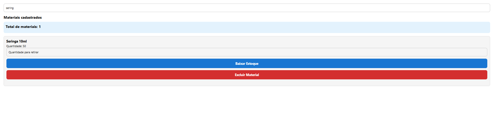
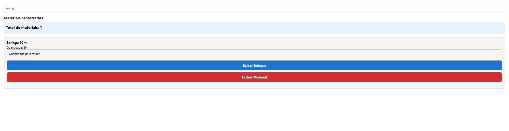

# Controle de Almoxarifado

Aplicativo mobile desenvolvido em **React Native + Expo** para controle de estoque de materiais de enfermagem, consumindo uma API REST hospedada no MockAPI.

## Objetivo

O projeto foi desenvolvido durante as Sprints da disciplina de Desenvolvimento Mobile com o objetivo de modernizar o controle de materiais utilizados em um almoxarifado hospitalar.

O aplicativo permite cadastrar materiais, consultar o estoque, realizar baixas de materiais, excluir registros e acompanhar indicadores em tempo real.

---

# Tecnologias utilizadas

- React Native
- Expo
- JavaScript
- MockAPI
- Fetch API

---

# Funcionalidades

## Sprint 1

- Cadastro de materiais.
- Listagem dinâmica de materiais.
- Consumo de API REST (GET).
- Cadastro de materiais utilizando POST.
- Atualização automática da lista após cadastro.

## Sprint 2

- Baixa de estoque.
- Validação para impedir estoque negativo.
- Atualização do estoque utilizando PUT.
- Exclusão de materiais utilizando DELETE.
- Atualização automática da interface após alterações.
- Função `validarRetirada` utilizada para impedir operações inválidas.

## Sprint 3

- Pesquisa de materiais em tempo real.
- Dashboard com totalizador de materiais.
- Indicador visual para estoque crítico.
- Tratamento de erros de conexão com mensagens amigáveis.
- Destaque visual para materiais com quantidade inferior a 10 unidades.

---

# Como executar o projeto

## Instalar as dependências

```bash
npm install
```

## Executar utilizando o Expo

```bash
npm start
```

ou

```bash
npx expo start
```

Após iniciar o Expo, utilize o aplicativo **Expo Go** em um dispositivo Android ou iOS para abrir o projeto através do QR Code.

---

# Estrutura do projeto

```text
.
├── App.js
├── package.json
├── README.md
├── __tests__
│   ├── sprint1.test.js
│   ├── sprint2.test.js
│   └── sprint3.test.js
└── src
    └── utils
        └── validacoes.js
```

---

# Screenshots

## Tela principal



Tela inicial do aplicativo contendo formulário de cadastro, dashboard com totalizador de materiais e lista completa de itens cadastrados.

---

## Cadastro de materiais



Exemplo do preenchimento dos campos para cadastro de um novo material no almoxarifado.

---

## Pesquisa de materiais



Filtro de pesquisa em funcionamento, realizando a busca parcial por materiais cadastrados e atualizando automaticamente o totalizador.

---

## Estoque crítico



Exemplo do indicador visual de estoque crítico para materiais com quantidade inferior a 10 unidades.

---

# Autor

**Alexandre Santos**

Projeto desenvolvido para a disciplina de Desenvolvimento Mobile da UniCesumar.
